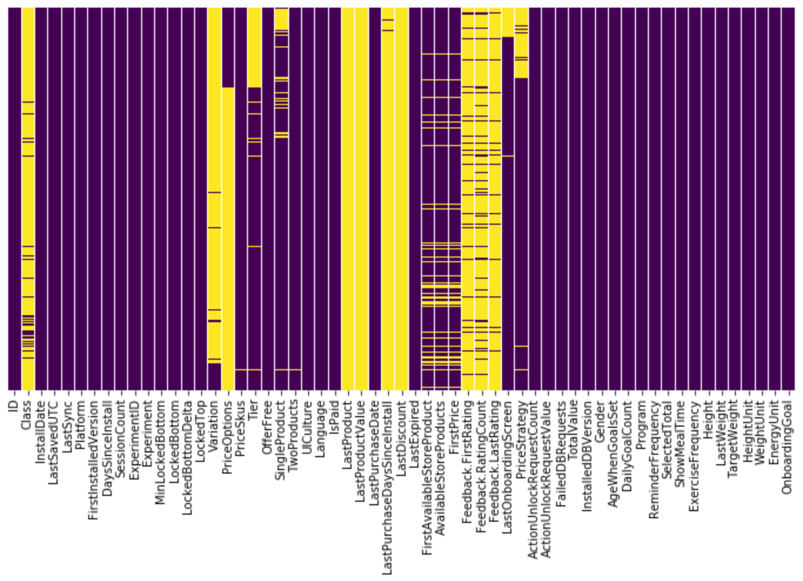
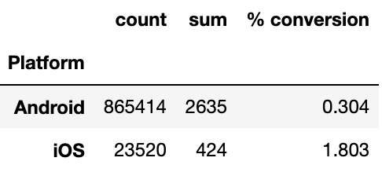
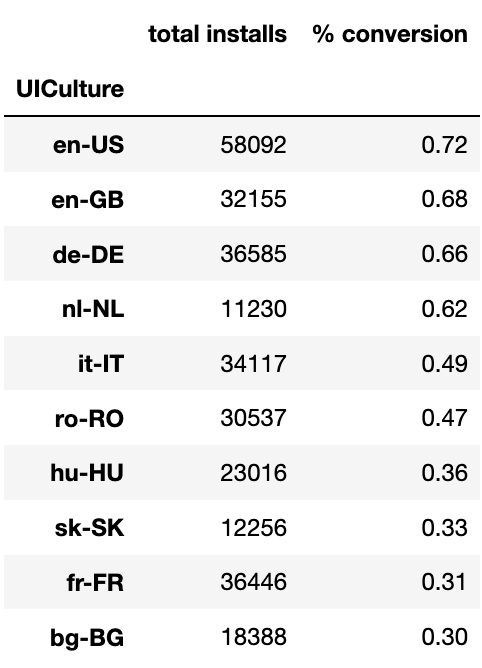
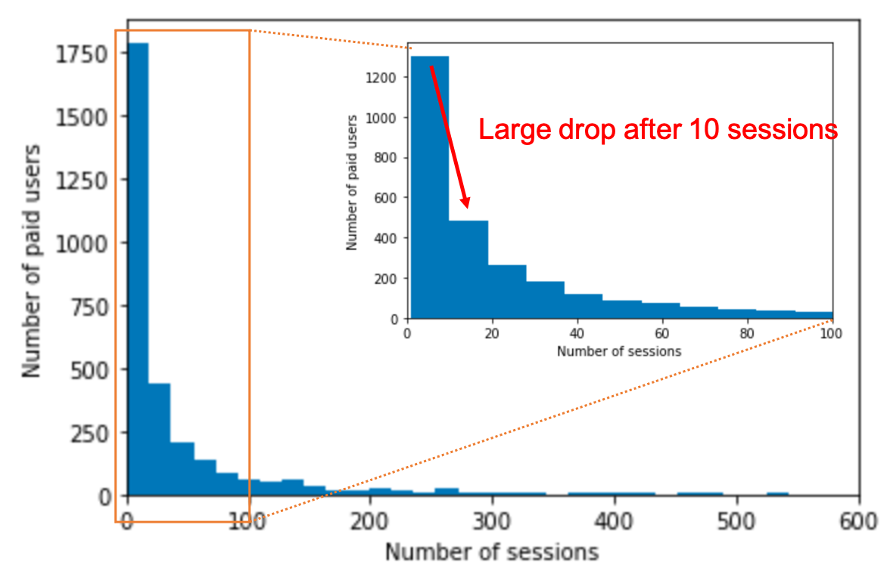
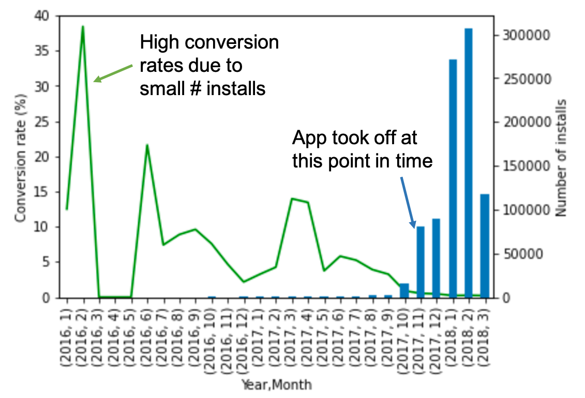
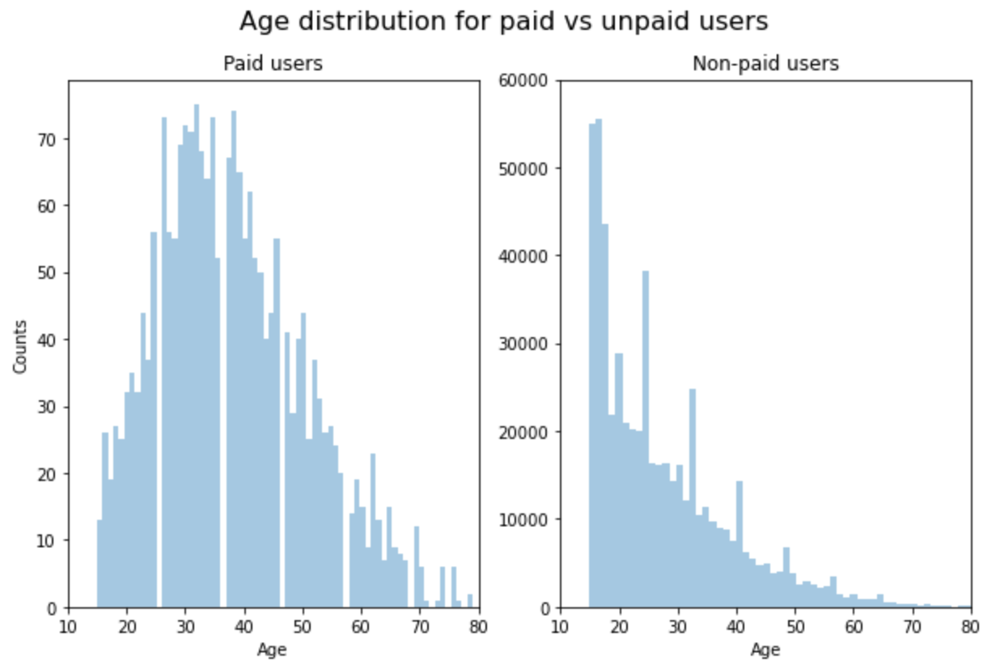

# App health tracking

**Product**: Health tracking and food journal mobile app to help users track their food intake (nutrition, calories, etc)

**Opportunity**: Data from the mobile app had not been analyzed or was being used in any way. There was potential to better understand the users' needs and typical use cases, and in understanding this, would potentially be able to do targetted marketing, prioritize specific app features for development, and distinguish themselves from other apps.

**Challenge**: Small dataset and whether or not relevant data exists

**Solution**: Do exploratory data analysis with focus on key aspects of understanding who the user is and how they use the app

**Result**: We were able to determine subsets of users that were more likely to subsribe to the app: [iOS users](#iOS-users), users who were offered a [free trial](#offer-free), and those from specific [countries](#UICulture) (US, UK, etc).

## Data analysis process:
- [data cleaning and feature engineering](#data-clean-feature-eng)
- [data visualization](#data-viz)
- discussion with client on what aspects they were most interested in to focus on: analysis of previously-run campaign where a specific product was offered, in hopes of increasing user conversion
- determination of [optimal product pricing](#opt-price) for different markets
- [testing sampling techniques on imbalanced dataset](#test-techniques) to determine if we could predict which user would subscribe (shortcut to answer: we could not do this given the data sparsity and lack of features that would indicate a positive or negative result)

### Data cleaning and feature engineering

Brief background on this mobile app:
- enables users to sign up and state their goals (i.e. weight loss/gain, nutritional goals, eating healthier, etc)
- typical use case: user eats a food/meal, inputs the food into the app, and app logs the food and tracks caloric and macronutrient data from online databases

Dataset:
- ~ 900,000 rows across 59 features, which can be categorized into "device" features and "human user" features

<figure>
  <figcaption>Visualization of complete and missing entries in dataset (purple: complete, yellow: missing)</figcaption>
  
</figure>

During exploratory data analysis, we were interested to see if there were any indications on who was paying for the app. We first look at the device-related features, then user-related features.

 One feature showing a large signal was "Platform", Android or iOS device. iOS device users are 6x more likely to subscribe to the app than Android users, with conversion rates of 1.8% and 0.33% respectively. Performing a statistical hypothesis test with the number of observations and number of converted users in each group (Android vs iOS) indeed shows that the conversion rates of these two groups are not equal.

<figure>
  <figcaption>iOS users 6x more likely to subscribe to the app than Android users</figcaption>
  
</figure>

<figure>
  <figcaption>Users from countries with high conversion rates</figcaption>
  
</figure>

Which type of users were more likely to subscribe to the app?  
- **iOS users** were 6x more likely than Android users (feature: "Platform")
- users who were **offered a free trial** with full access to app features were 3x more likely than users not offered any trial
- users in the **US, Great Britain, Denmark, and Netherlands** have the highest conversion rates
- users who **input information during signup**, such as age, gender, etc
- users who recorded their **gender as 'male'** were 3x more likely to subscribe compared to 'female' and 'none'
- users who recorded their **age** were 2.5x more likely to subscribe compared to those who did not
- users who indicated that they wanted the app to **show meal-time reminders** were 7.5x more likely to subsribe compared to those who did not want a reminder

- age, gender, device type android/iphone, goals, target weight

### Data visualization

- plot of conversion rate over time 1-2016 thru 3-2018
- age dist for paid vs unpaid users (remove zero from unpaid users)

<figure>
  <figcaption>After 10 sessions, many paid users stop using the app</figcaption>
  
</figure>

<figure>
  <figcaption>App downloads took off around November 2017</figcaption>
  
</figure>

<figure>
  <figcaption>Age distributions of paid vs non-paid users indicate an effect on age and likelihood of subscribing</figcaption>
  
</figure>

By visualizing the data, we learn some interesting facts:
- The number of sessions, where a paid user opens and logs something in the app, drops significantly, even after only 10 sessions. This could indicate a bug in data collecting or in the app itself that discourages usage. There are, however, some paid users who continue using the app. It may be interesting to look more closely at this group of users to see if anything distinguishes them from the larger group of paid users- perhaps they are early adopters.
- App downloads really took off around November 2017. With a larger number of installs, the conversion rate also stabilized to where it is currently, ~0.2% out of all downloads.
- Another point.

### Optimal product pricing for different markets

App developer offered a product "Q" at different price points to users

### Predict user subscription? (No, mostly an exercise to test sampling techniques on imbalanced dataset)